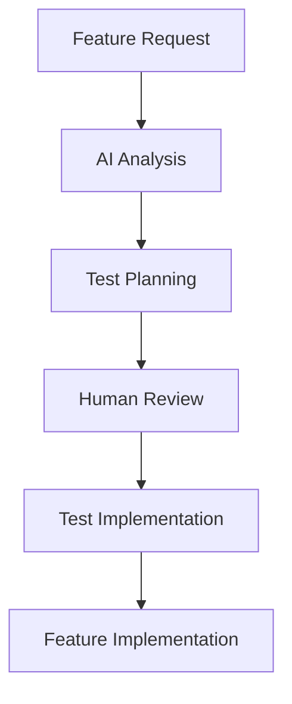
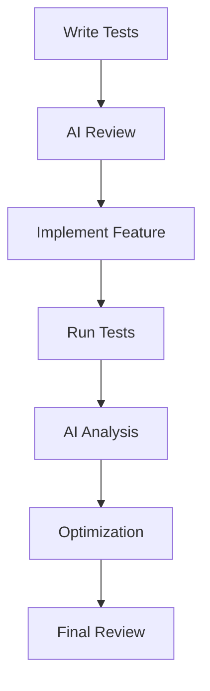

# AI Development Guide

## Overview
This guide provides instructions for AI-assisted development of the Feed Processing System. It outlines best practices, workflows, and patterns for effective collaboration between human developers and AI assistants.

## AI-Assisted Development Workflow

### 1. Feature Planning


### 2. Code Development Process


## Documentation Standards

### 1. Code Documentation
```python
"""
Component: [Component Name]
ID: [Component ID]
Category: [Category]

Purpose:
[Detailed description of the component's purpose]

AI Considerations:
1. [Consideration 1]
2. [Consideration 2]

Performance Characteristics:
- Memory Usage: [Expected range]
- CPU Usage: [Expected range]
- Response Time: [Expected range]

Example Usage:
```python
# Example code here
```

Test Scenarios:
1. [Scenario 1]
2. [Scenario 2]
"""
```

### 2. Test Documentation
```python
"""
Test ID: [Test ID]
Category: [Test Category]

Purpose:
[Test purpose description]

AI Testing Focus:
- [Focus point 1]
- [Focus point 2]

Metrics:
- [Metric 1]: [Expected value]
- [Metric 2]: [Expected value]

Scenarios:
1. [Scenario 1]
2. [Scenario 2]
"""
```

## AI Interaction Guidelines

### 1. Code Review Requests
When requesting AI code review, provide:
- Component context
- Performance requirements
- Security considerations
- Test coverage expectations

### 2. Implementation Assistance
When seeking implementation help:
- Provide test cases first
- Specify performance constraints
- Include security requirements
- Define success criteria

### 3. Documentation Updates
When updating documentation:
- Include AI considerations
- Add performance characteristics
- Document test scenarios
- Specify resource requirements

## Best Practices

### 1. Test-Driven Development
- Write tests before implementation
- Include AI-specific test cases
- Document performance requirements
- Specify resource constraints

### 2. Code Organization
- Use consistent file structure
- Follow naming conventions
- Include comprehensive comments
- Document AI considerations

### 3. Performance Optimization
- Define clear metrics
- Document resource usage
- Specify optimization goals
- Include monitoring points

## Common Patterns

### 1. Error Handling
```python
try:
    # Operation with clear context
    result = operation()
except SpecificError as e:
    # Error handling with AI considerations
    logger.error("Context: %s, Error: %s", context, str(e))
    metrics.increment("error_count")
    raise ProcessingError(f"Operation failed: {str(e)}")
```

### 2. Performance Monitoring
```python
def monitored_operation():
    start_time = time.time()
    start_memory = get_memory_usage()

    try:
        result = perform_operation()

        # Record metrics
        duration = time.time() - start_time
        memory_used = get_memory_usage() - start_memory
        record_metrics(duration, memory_used)

        return result
    except Exception as e:
        record_error_metrics()
        raise
```

### 3. Resource Management
```python
class ManagedResource:
    def __init__(self, max_size):
        self.max_size = max_size
        self.current_size = 0

    def __enter__(self):
        # Resource acquisition with monitoring
        monitor_resource_acquisition()
        return self

    def __exit__(self, exc_type, exc_val, exc_tb):
        # Resource cleanup with verification
        cleanup_and_verify()
```

## AI Development Tools

### 1. Code Analysis
- Static analysis tools
- Performance profilers
- Memory analyzers
- Security scanners

### 2. Testing Tools
- Test runners
- Coverage tools
- Performance benchmarks
- Load testing tools

### 3. Documentation Tools
- Documentation generators
- API documentation
- Performance reports
- Security assessments

## Troubleshooting Guide

### 1. Performance Issues
- Check resource usage
- Review performance metrics
- Analyze bottlenecks
- Verify optimizations

### 2. Test Failures
- Review test context
- Check resource state
- Verify assumptions
- Analyze error patterns

### 3. Integration Issues
- Verify component interfaces
- Check data flow
- Review error handling
- Monitor resource usage
