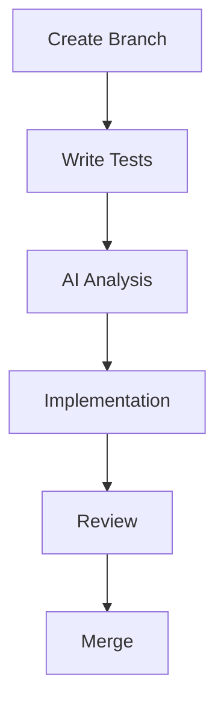
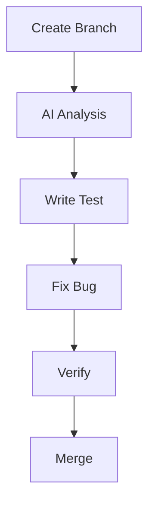
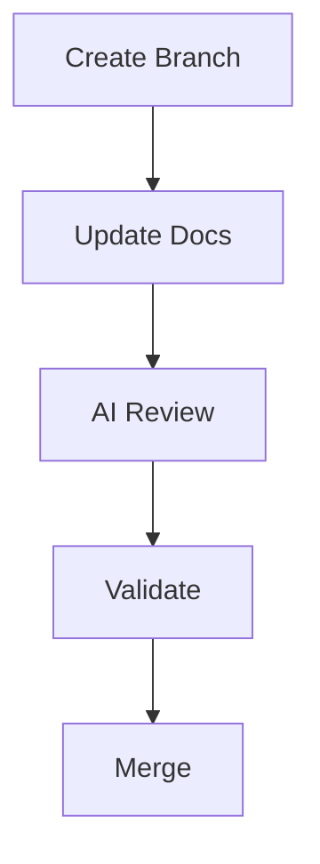

# Git Workflow for AI-Assisted Development

## Branch Structure

```
main
  └── develop
       ├── feature/AI-XXX
       ├── bugfix/AI-XXX
       └── test/AI-XXX
```

## Branch Naming Convention

- `feature/AI-XXX`: New features with AI assistance
- `bugfix/AI-XXX`: Bug fixes with AI analysis
- `test/AI-XXX`: AI-specific test additions
- `docs/AI-XXX`: AI-related documentation

## Commit Message Format

```
[AI-XXX] category: Brief description

Detailed description of changes
- Change 1
- Change 2

AI Considerations:
- Consideration 1
- Consideration 2

Performance Impact:
- Impact 1
- Impact 2

Test Coverage:
- Test 1
- Test 2
```

Categories:
- `feat`: New feature
- `fix`: Bug fix
- `test`: Test changes
- `docs`: Documentation
- `perf`: Performance improvement
- `refactor`: Code refactoring

## Workflow Steps

### 1. Starting New Work

```bash
# Update main branch
git checkout main
git pull origin main

# Create new branch
git checkout -b feature/AI-XXX
```

### 2. Development Process

```bash
# Make changes
git add .
git commit -m "[AI-XXX] feat: Add new feature

Detailed description of the feature implementation

AI Considerations:
- Performance optimized
- Security verified

Performance Impact:
- Memory usage < 500MB
- Response time < 2s

Test Coverage:
- Unit tests added
- Performance tests included"
```

### 3. Code Review Process

```bash
# Push changes
git push origin feature/AI-XXX

# Create pull request with:
- AI analysis results
- Performance metrics
- Test coverage report
- Security scan results
```

### 4. Merging Process

```bash
# Update branch
git checkout feature/AI-XXX
git pull origin develop
git push origin feature/AI-XXX

# After approval, merge via PR
```

## CI/CD Pipeline

### 1. Automated Checks
- AI-specific tests
- Performance tests
- Security scans
- Documentation updates

### 2. Review Requirements
- All AI tests passing
- Performance metrics met
- Security checks passed
- Documentation updated

### 3. Merge Criteria
- Code review approved
- CI/CD pipeline passed
- Documentation complete
- Tests comprehensive

## Best Practices

### 1. Commit Guidelines
- Write clear commit messages
- Include AI considerations
- Document performance impact
- List test coverage

### 2. Branch Management
- Keep branches focused
- Regular updates from develop
- Clean commit history
- Descriptive branch names

### 3. Code Review
- Review AI analysis
- Check performance metrics
- Verify test coverage
- Validate documentation

### 4. Documentation
- Update relevant docs
- Include AI context
- Document changes
- Note considerations

## Common Workflows

### 1. Feature Development


### 2. Bug Fixing


### 3. Documentation


## Troubleshooting

### 1. Failed CI Checks
- Review test logs
- Check AI analysis
- Verify performance
- Update tests

### 2. Merge Conflicts
- Update from develop
- Resolve conflicts
- Run tests
- Verify changes

### 3. Performance Issues
- Review metrics
- Optimize code
- Update tests
- Document changes
