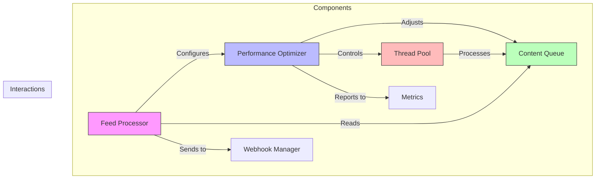
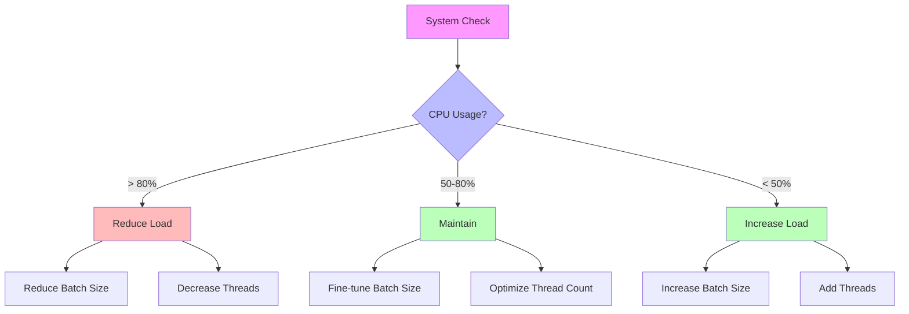
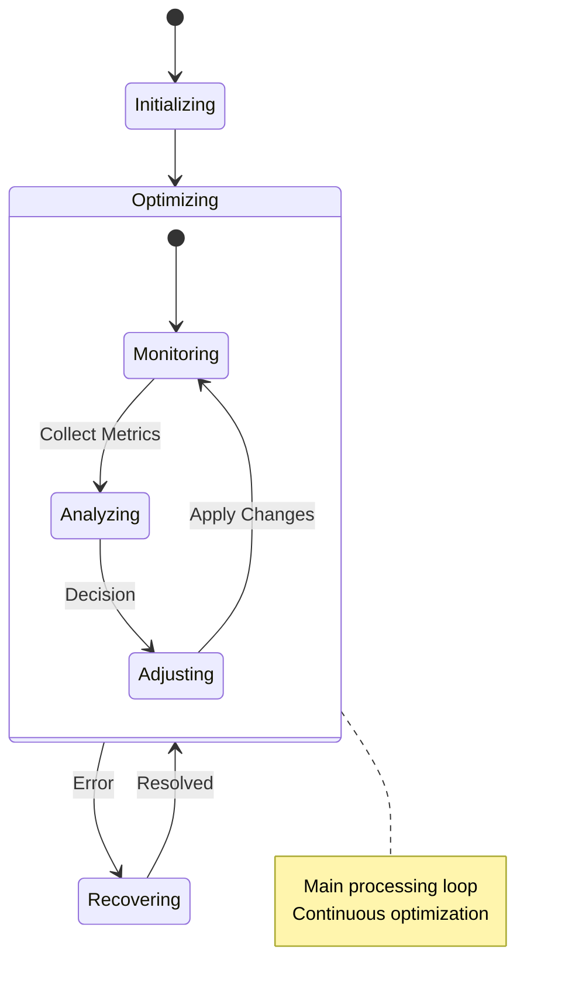
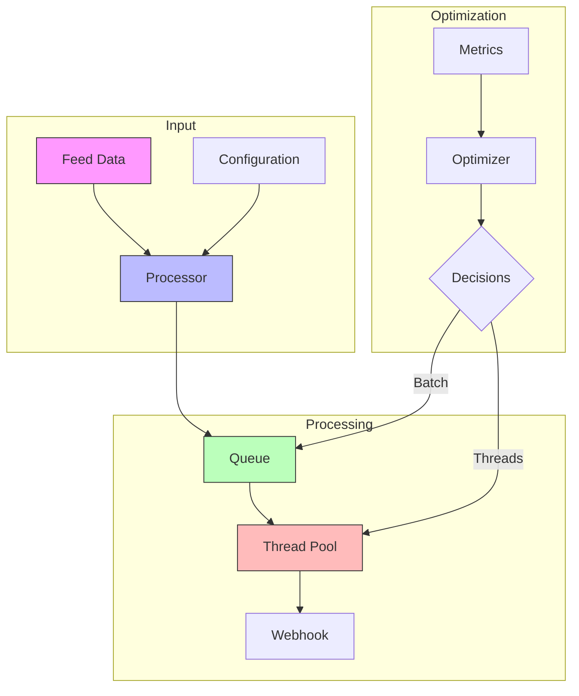
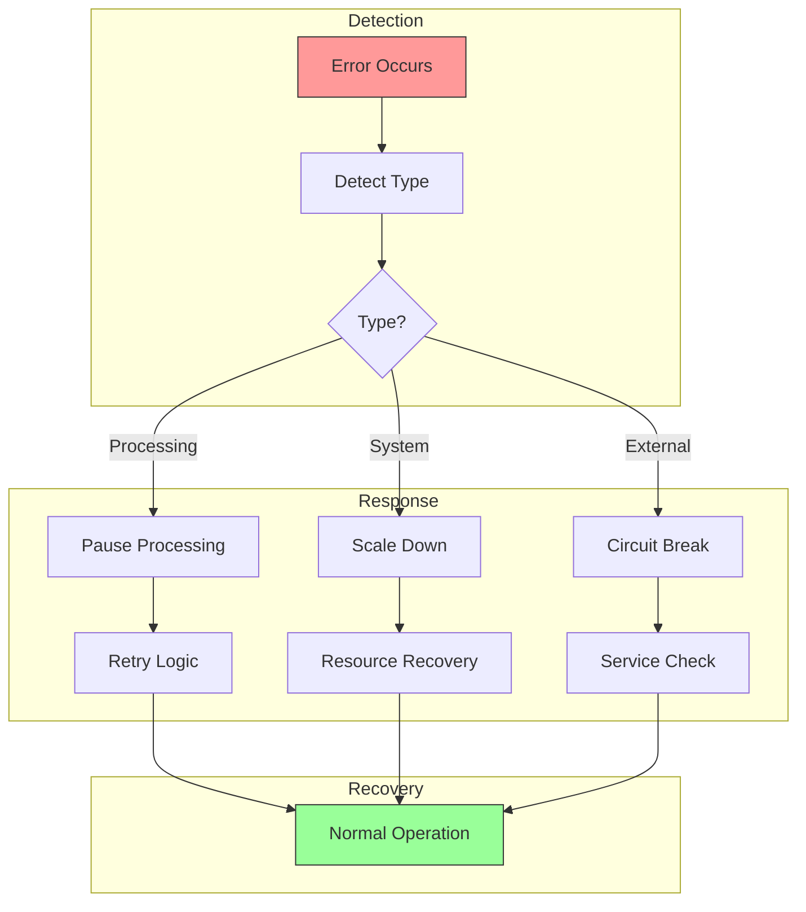
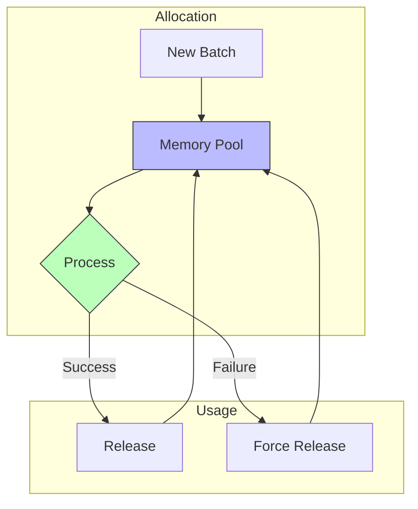
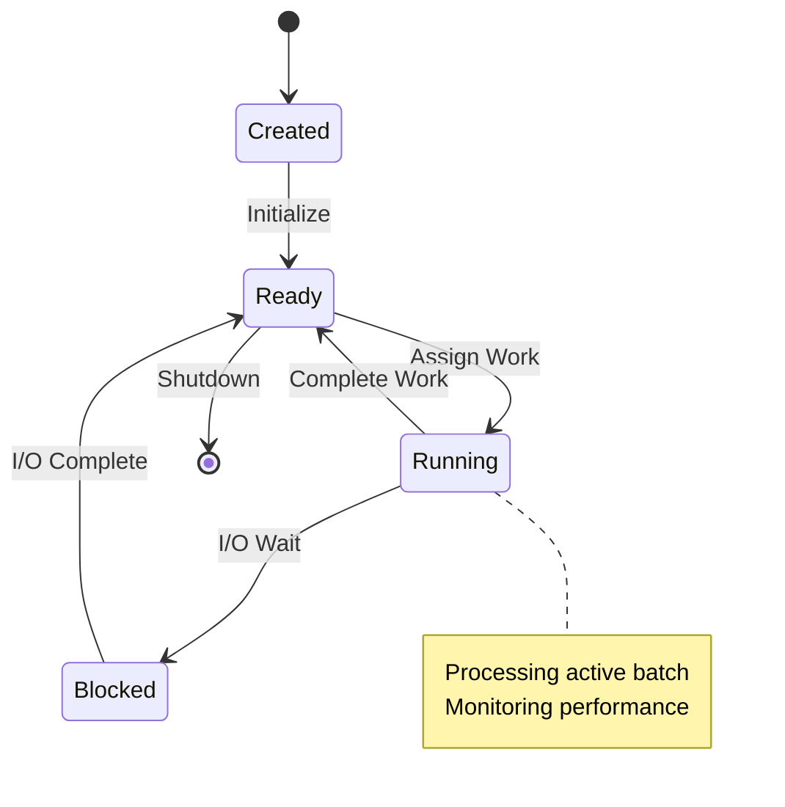
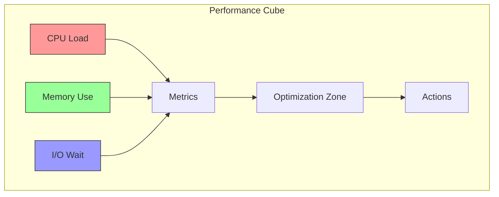
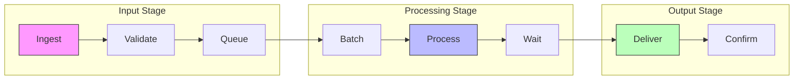

# Advanced Feed Processor Optimization Diagrams

## Component Interaction Matrix

## Decision Tree

## System States (Animated)

## Data Flow (Detailed)

## Resource Allocation (Animated)

```mermaid
gantt
    title Resource Allocation Over Time
    dateFormat  HH:mm
    axisFormat %H:%M

    section Batch Size
    Initial Size      :a1, 00:00, 2m
    Increase         :a2, after a1, 3m
    Optimal Size     :a3, after a2, 5m

    section Threads
    Base Threads     :t1, 00:00, 2m
    Scale Up        :t2, after t1, 2m
    Scale Down      :t3, after t2, 3m
```

## Error Recovery Flow

## Memory Management (Animated)

## Thread Lifecycle (Animated)

## Performance Zones (3D View)

## Batch Processing Pipeline

These advanced diagrams provide:
1. Detailed component interactions
2. Animated workflow sequences
3. Resource allocation visualization
4. Error recovery patterns
5. Memory and thread management
6. Performance zone mapping
7. Pipeline visualization

The animations help visualize:
1. State transitions
2. Resource allocation changes
3. Error recovery processes
4. Memory management cycles
5. Thread lifecycle

Would you like me to:
1. Add more specific types of diagrams
2. Create more detailed animations
3. Add interactive elements
4. Something else?
