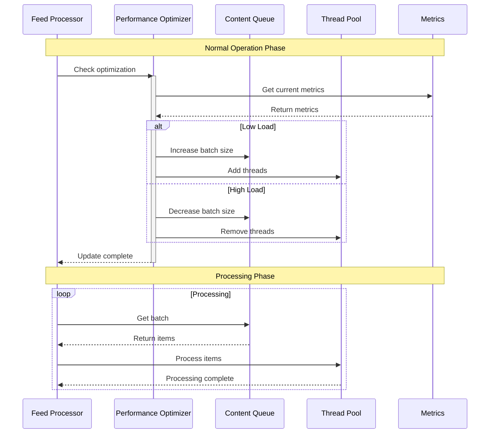
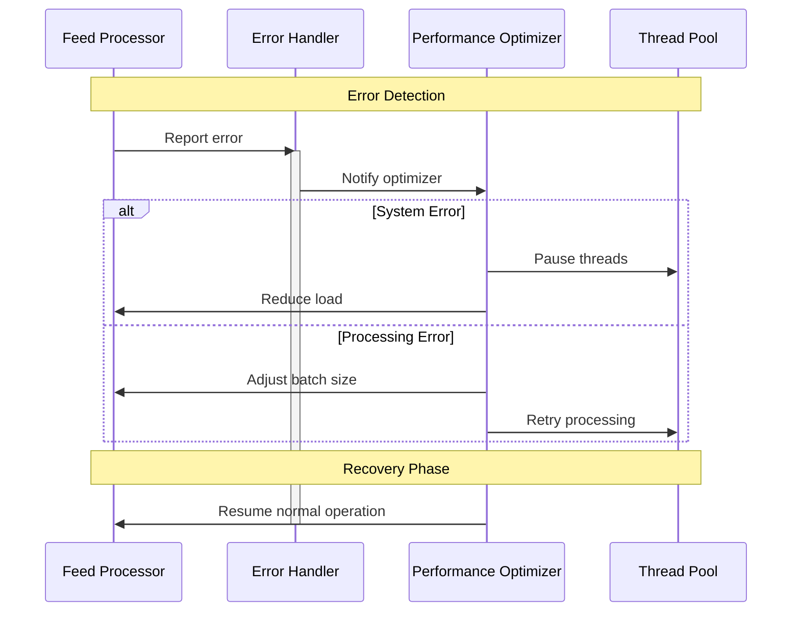
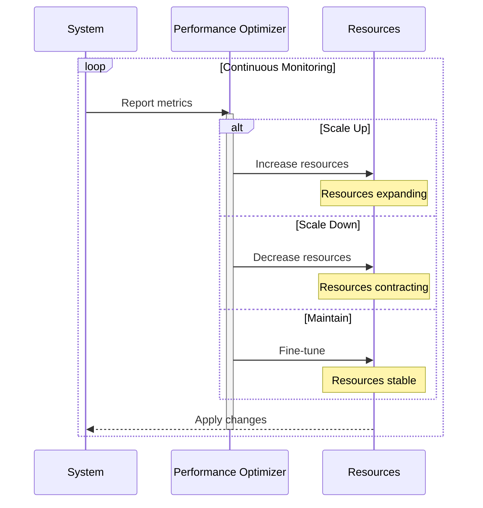
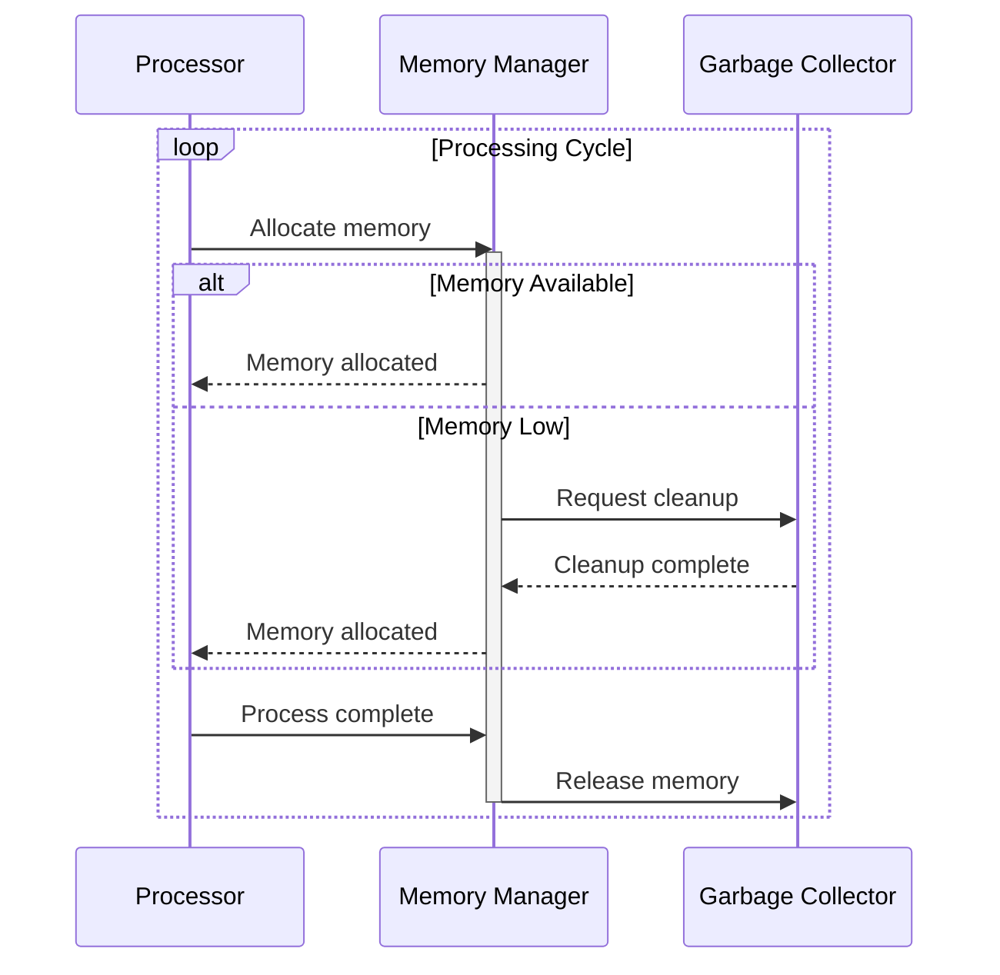
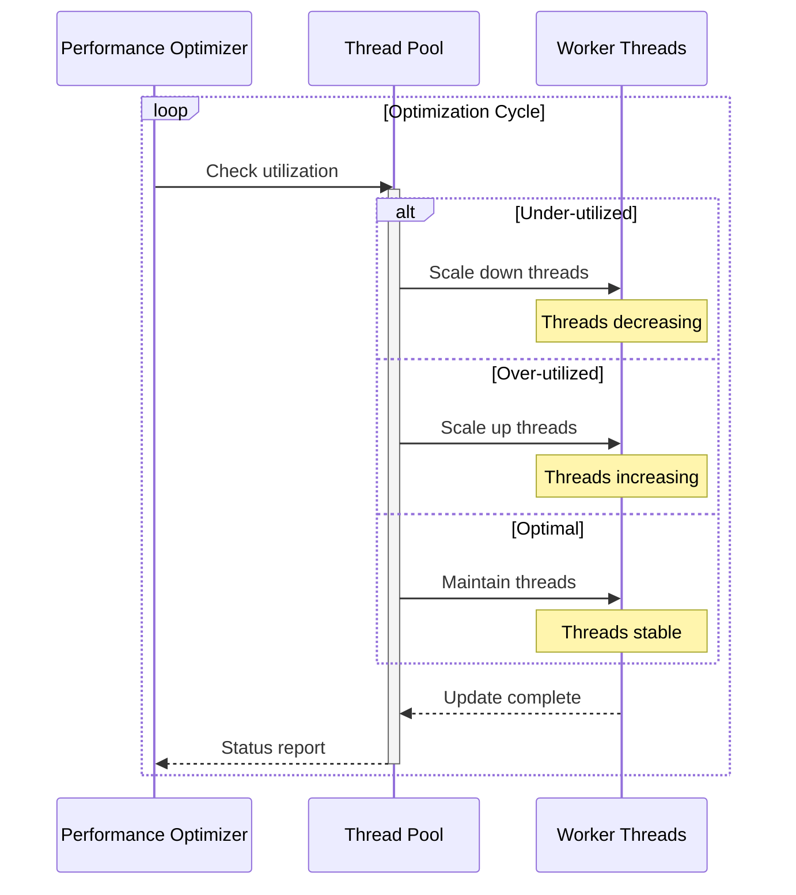
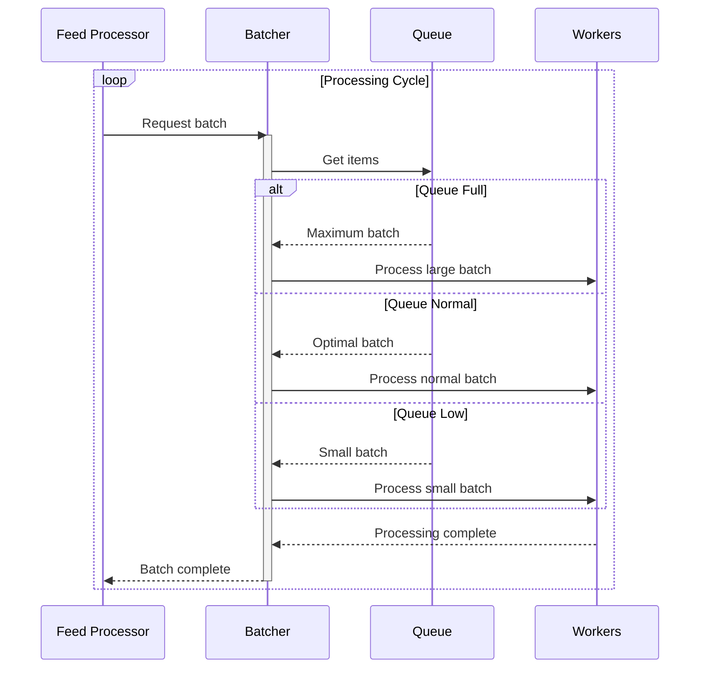

# Feed Processor Animated Workflows

This document provides animated sequence diagrams showing key system workflows in action.

## Optimization Cycle

## Error Recovery Sequence

## Resource Scaling Animation

## Memory Management Cycle

## Thread Pool Dynamics

## Batch Processing Animation

These animated sequences show:
1. Real-time optimization decisions
2. Error handling flows
3. Resource scaling behavior
4. Memory management cycles
5. Thread pool dynamics
6. Batch processing patterns

The animations help visualize:
- State transitions
- Decision points
- Resource allocation
- System responses
- Processing flows

Would you like me to:
1. Add more specific workflows
2. Create more detailed animations
3. Add timing diagrams
4. Something else?
