# Feed Processor Optimization System Diagrams

This document provides visual representations of the optimization system's architecture and workflows.

## System Architecture

## Optimization Workflow

## Resource Usage Patterns

## Batch Size Optimization

## Thread Pool Management

```mermaid
stateDiagram-v2
    [*] --> Idle
    Idle --> Active: New Work
    Active --> Idle: Work Complete
    Active --> Waiting: I/O Block
    Waiting --> Active: I/O Complete

    state Active {
        [*] --> Processing
        Processing --> Optimizing: Check Load
        Optimizing --> Processing: Apply Changes
    }
```

## Performance Metrics Flow

## Resource Utilization Zones

## Error Handling and Recovery

These diagrams provide visual representations of:
1. Overall system architecture
2. Optimization workflow
3. Resource usage patterns
4. Batch size optimization process
5. Thread pool management
6. Performance metrics flow
7. Resource utilization zones
8. Error handling and recovery

Each diagram helps explain different aspects of the optimization system, making it easier to understand how the components work together and how the system responds to different conditions.
